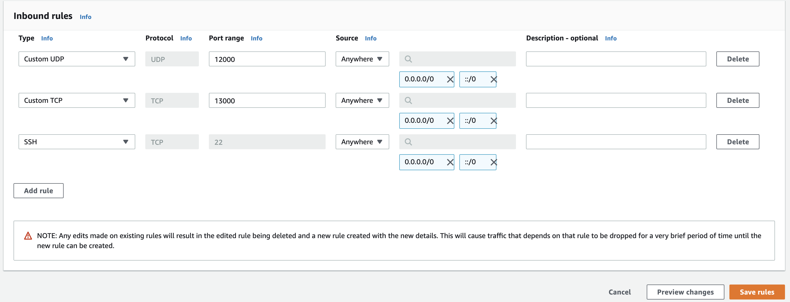

[](https://www.bloxstaking.com/)

<br>
<br>

# SSV - Operator Getting Started Guide

## Running a Local Network of Operators

#### 1. Clone Repository

```bash
$ git clone https://github.com/ethereum/eth2-ssv.git
```

#### 2. Build Binary

```bash
$ CGO_ENABLED=1 go build -o ./bin/ssvnode ./cmd/ssvnode/
```

#### 3. Generate Operator Key 

See [Dev Guide > Generating an Operator Key](./DEV_GUIDE.md#generating-an-operator-key).

#### 4. Split Validator Key 

See [Dev Guide > Splitting a Validator Key](./DEV_GUIDE.md#splitting-a-validator-key).

#### 5. Create Config Files

  ##### 5.1. Node Config

  Fill the required fields in [config.yaml](../config/config.yaml) file

  ##### 5.2. Shares Config

  Create 4 .yaml files with the corresponding configuration, based on the [template file](../config/example_share.yaml). \
  The files should be placed in the `./config` directory (`./config/share1.yaml`, `./config/share2.yaml`, etc.)

#### 6. Run a local network with 4 nodes
```bash
$ make docker-debug 
```

## Setting AWS Server for Operator

### Setup

Create a server of your choice and expose on ports 12000 UDP and 13000 TCP.
- In the search bar search for "ec2"
- Launch new instance
- Choose "ubuntu server 20.04"
- Choose "t2.micro" (free tire)
- Skip to "security group" section
- make sure you have 3 rules. UDP, TCP and SSH -
  
- after launch, add new key pair and download the ssh file
- launch instance

### Login with SSH

```
$ cd ./{path to where the ssh downloaded}

$ chmod 400 {ssh file name}

$ ssh -i {ssh file name} ubuntu@{server public ip}
```

### Create .env file

Export all required params and fill the required fields.

```
$ touch .env

$ echo "CONSENSUS_TYPE=validation" >> .env
$ echo "STORAGE_PATH={db data path}" >> .env
$ echo "NETWORK=pyrmont" >> .env
$ echo "BEACON_NODE_ADDR={ETH 2.0 node}" >> .env
$ echo "VALIDATOR_PUBLIC_KEY={validator public key}" >> .env
$ echo "NODE_ID={provided node index}" >> .env
$ echo "SSV_PRIVATE_KEY={provided node private key}" >> .env
$ echo "PUBKEY_NODE_1={provided node index 1 public key}" >> .env
$ echo "PUBKEY_NODE_2={provided node index 2 public key}" >> .env
$ echo "PUBKEY_NODE_3={provided node index 3 public key}" >> .env 
$ echo "PUBKEY_NODE_4={provided node index 4 public key}" >> .env
```

### Installation Script

Download and run the installation script.

```
$ sudo su

$ wget https://raw.githubusercontent.com/ethereum/eth2-ssv/stage/install.sh

$ chmod +x install.sh

$ ./install.sh
```